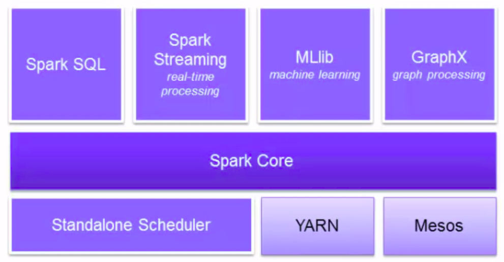

# Spark Introduction
Content:
- [A. Introduction](#introduction)
- [B. Setup spark standalone](#standalone)
- [C. Setup environment for practicing spark locally](#practice)
- [D. Practice](#code)

### A. Introduction <a name="introduction"></a>
- Apache Spark is a computing platform designed to be fast, general purpose and easy to use. A parallel distributed processing, fault tolerance on commodity hardware, scalability, `in-memory computing`
- Spark unified stack
    <div align="center">
        
    </div>
- Resilient Distributed Dataset (`RDD`): spark's primary abstraction, distributed collection of elements, parallelized across the cluster, caching. 2 types RDD operations:
    - `Transformations`: create direct acyclic graph (DAG), lazy evaluation, no return value
    - `Actions`: Performs the transformations and return a value

### B. Setup spark standalone <a name="standalone"></a>
This guideline is a basic setup for standalone. It will help you how to setup and start master and worker on your computer.

1. Install java
    ```
    java -version
    sudo apt-get install default-jdk
    ```
2. Download spark
    ```
    curl -O http://mirror.downloadvn.com/apache/spark/spark-2.4.4/spark-2.4.4-bin-hadoop2.7.tgz
    ```
3. Extract to /usr/local/spark
    ```
    sudo tar xvf spark-2.4.4-bin-hadoop2.7.tgz
    sudo mv spark-2.4.4-bin-hadoop2.7 /usr/local/spark
    ```
4. Add Spark path to bash file and execute ~/.bashrc
    ```
    nano ~/.bashrc
    SPARK_HOME=/usr/local/spark
    export PATH=$PATH:$SPARK_HOME/bin:$SPARK_HOME/sbin
    source ~/.bashrc
    ```
5. *Option*, You can see more in `/usr/local/spark/bin` or `/usr/local/spark/sbin`. For example, start master and work link to master in standard alone
    ```
    /usr/local/spark/sbin/start-all.sh
    ```

### C. Setup environment for practicing spark locally <a name="practice"></a>
This guideline will help you setup virtual environment, install pyspark and jupyterlab for practice

1. Setup virtual environment
- Install virtualenv by pip in ubuntu, open terminal and type:
    ```
    pip install virtualenv
    ```
- Create virtual environment for project:
    ```
    # go to your project
    cd your_project
    # create virtualenv with python 3.6 or other versions
    virtualenv -p /usr/bin/python3.6 venv
    ```
- Activate your venv
    ```
    source venv/bin/activate
    ```
- Now, you had an activate environment for development, you can install libraries into `venv`. To deactivate:
    ```
    deactivate
    ``` 
2. Install pyspark into `venv`
    ```
    pip install pyspark
    ```

3. Install jupyterlab into `venv` and practice
- Install jupyterlab
    ```
    pip install jupyterlab
    ```
- Start jupyterlab
    ```
    jupyter lab
    ```
    
### D. Practice <a name="code"></a>
Let's do something with [jupyter lab](../code/1_introduction.ipynb). Enjoy !